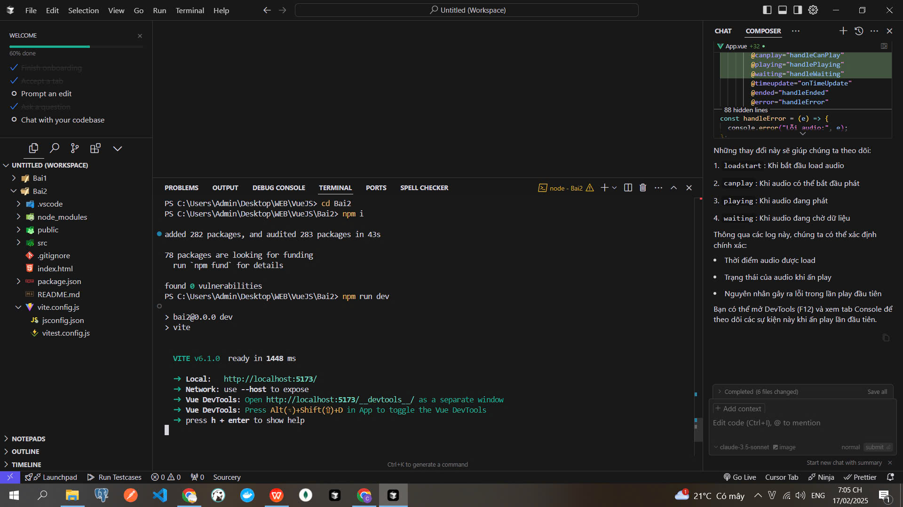

# Ứng Dụng Chat với Vue 3 và Groq API

Đây là một ứng dụng chat đơn giản được xây dựng bằng Vue 3, sử dụng Groq API để tạo ra các phản hồi thông minh.

## Tính Năng Chính

- Giao diện chat trực quan, dễ sử dụng
- Tích hợp với Groq API để tạo phản hồi tự động
- Hỗ trợ cuộn tự động đến tin nhắn mới nhất
- Hiển thị trạng thái đang xử lý khi chờ phản hồi
- Thiết kế responsive, tương thích với nhiều kích thước màn hình
- Hỗ trợ dark mode tự động theo cài đặt hệ thống

## Cài Đặt

1. Clone dependencies:

   ```bash
   npm install
   ```

2. Tạo file .env và thêm API key của Groq:

   ```bash
   VITE_GROQ_API_KEY=your_api_key_here
   ```

3. Chạy ứng dụng:

   ```bash
   npm run dev
   ```

## Cấu Trúc Project

- `src/App.vue`: Component chính chứa logic chat và giao diện
- `src/assets/`: Chứa các file CSS và tài nguyên tĩnh
- `src/components/`: Các component phụ trợ
- `src/router/`: Cấu hình routing
- `src/stores/`: Quản lý state với Pinia
- `src/views/`: Các view chính của ứng dụng

## Cách Sử Dụng

1. Khi khởi động, ứng dụng sẽ hiển thị tin nhắn chào mừng
2. Người dùng có thể nhập tin nhắn vào ô input ở dưới cùng
3. Nhấn Enter hoặc nút "Gửi" để gửi tin nhắn
4. Hệ thống sẽ tự động gửi yêu cầu đến Groq API và hiển thị phản hồi
5. Các tin nhắn sẽ tự động cuộn xuống khi có tin nhắn mới

## Xử Lý Lỗi

- Hiển thị thông báo lỗi khi không thể kết nối với API
- Tự động thử lại khi gặp lỗi mạng
- Hiển thị trạng thái loading trong quá trình xử lý

## Công Nghệ Sử Dụng

- Vue 3 Composition API
- Vue Router
- Pinia State Management
- Vite
- Groq API
- CSS Variables cho theming

## Quá trình làm





